# Nexus Context Diagram

A high-level architectural view of Nexus, showing external actors, internal
runtime substrate, skill routing, sidecar runtimes, and the persistence
boundary. Use this as a single-glance reference when validating new design
choices or onboarding a contributor.

For component-level detail, see `lib/nexus/README.md`. For work-in-progress
remediation, see `docs/architecture/post-audit-cleanup-plan.md`.

---

## Diagram

```mermaid
graph TB
    Human(["Human Engineer"])

    subgraph Hosts["AI Coding Hosts<br/>(interactive front doors)"]
        direction LR
        Claude["Claude Code"]
        Codex["Codex CLI"]
        Gemini["Gemini CLI"]
        Factory["Factory Droid"]
    end

    subgraph External["External Systems"]
        direction LR
        GitHub[("GitHub<br/>PRs / Issues")]
        Browser["Chrome / Puppeteer"]
        CCB{{"CCB Bridge<br/>multi-provider transport"}}
    end

    subgraph Nexus["Nexus - single-package AI engineering OS"]
        direction TB
        CLI["bin/nexus<br/>executable shim"]

        subgraph Substrate["lib/nexus/ runtime substrate"]
            direction TB
            Cmds["commands/<br/>9 lifecycle handlers"]
            Intent["intent-classifier/<br/>/nexus do"]
            SkillReg["skill-registry/<br/>manifest discovery + ranking"]
            Native["stage-content/ + stage-packs/<br/>native lifecycle prompts + builders"]
            Adapt["adapters/<br/>governed_ccb + local_provider"]
            State["ledger.ts + governance.ts + artifacts.ts<br/>state machine"]
            Norm["normalizers/<br/>adapter to canonical records"]
            Adv["completion-advisor/<br/>stage-aware recommendations"]
        end

        subgraph Side["runtimes/<br/>sidecar binaries"]
            direction LR
            Browse["browse/<br/>QA + sidebar agent"]
            Design["design/<br/>mockup + export pipeline"]
            Hooks["hooks/<br/>safety helpers"]
        end

        subgraph SkillsGen["skills/ to hosts/<br/>generated skill output"]
            direction LR
            Tmpl["skills/**/*.tmpl<br/>canonical / support / safety / aliases / root"]
            Manifests["nexus.skill.yaml<br/>routing metadata"]
            HostCfg["hosts/<br/>claude / codex / gemini-cli / factory"]
            Gen{{"bun run gen:skill-docs"}}
            Tmpl --> Gen
            Manifests --> Gen
            HostCfg --> Gen
        end
    end

    subgraph Persist["Persistence (repo-local, no remote DB)"]
        direction LR
        Planning[(".planning/<br/>governed artifacts + audits")]
        Cfg[("~/.nexus/<br/>config + workspace state")]
        GenSkills["Generated host skill roots<br/>.claude / .agents / .gemini / .factory"]
    end

    Human --> Claude
    Human -.alt.-> Codex
    Human -.alt.-> Gemini
    Human -.alt.-> Factory

    Claude -->|"reads SKILL.md<br/>invokes /command"| CLI
    Codex --> CLI
    Gemini --> CLI
    Factory --> CLI

    CLI --> Cmds
    CLI --> Intent
    Intent --> SkillReg
    Cmds -->|"loads native packs"| Native
    Cmds --> Adapt
    Cmds --> State
    Cmds --> Norm
    Cmds --> Adv
    Adv --> SkillReg
    SkillReg --> Adv

    Adapt -->|"governed_ccb mode"| CCB
    CCB --> Codex
    CCB --> Gemini

    Cmds -->|"gh subprocess"| GitHub
    Browse -->|spawns| Browser

    State -->|read/write| Planning
    State -.read.-> Cfg
    Browse -.file IPC.-> Planning
    Design -.file IPC.-> Planning
    Hooks -.file IPC.-> Planning

    Gen --> GenSkills
    Manifests -.installed with.-> GenSkills
    GenSkills -.discovered by.-> Hosts
    GenSkills -.scanned by.-> SkillReg

    classDef coreSystem fill:#e1f5ff,stroke:#0066cc,stroke-width:2px,color:#000
    classDef router fill:#eaf8e6,stroke:#2b8a3e,stroke-width:2px,color:#000
    classDef genArtifact fill:#f5f5f5,stroke:#999,stroke-dasharray:5 5,color:#666
    class Substrate coreSystem
    class SkillReg,Intent router
    class GenSkills genArtifact
```



---

## Layer Model

### 1. Hosts

Claude, Codex, Gemini CLI, and Factory load generated Nexus skill prose from
host-specific install roots. The host is the interactive shell; it reads
`SKILL.md` and invokes `./bin/nexus <command>`. Hosts do not own
lifecycle behavior.

### 2. CLI Entry

`bin/nexus` is the executable shim; `lib/nexus/cli/nexus.ts` resolves the runtime cwd, reads `~/.nexus/config.yaml` to choose
`governed_ccb` or `local_provider`, and dispatches to lifecycle handlers,
meta-command handlers such as `/nexus do`, or support surfaces.

### 3. Runtime Substrate

`lib/nexus/` owns the governed lifecycle and router contract:

- `commands/` implements the nine lifecycle handlers and writes governed
  artifacts.
- `stage-content/` and `stage-packs/` provide Nexus-native lifecycle content,
  prompt contracts, and builders. There is no active external source snapshot
  dependency in the runtime architecture.
- `intent-classifier/` powers `/nexus do` by matching free-form intent against
  SkillRegistry records.
- `skill-registry/` scans installed `SKILL.md` files, loads adjacent
  `nexus.skill.yaml` manifests, classifies skill namespaces, and ranks
  candidates for dispatch or advisor recommendations.
- `completion-advisor/` writes stage-completion records, including
  `recommended_skills` and `recommended_external_skills`.
- `adapters/`, `normalizers/`, `ledger.ts`, `governance.ts`, and `artifacts.ts`
  preserve Nexus's transport-independent truth model.

### 4. Sidecar Runtimes

`runtimes/browse/`, `runtimes/design/`, and `runtimes/hooks/` are compiled or
scripted sidecars. They communicate through filesystem artifacts and local
process boundaries rather than importing lifecycle internals as product
owners.

### 5. Skill Generation And Routing Metadata

Templates in `skills/**/*.tmpl`, routing manifests in `nexus.skill.yaml`, and
host configuration in `hosts/` compile into generated host skill roots. Skill
prose is agent-facing instruction; routing metadata is machine-readable input
for SkillRegistry and `/nexus do`.

### 6. Persistence

- `.planning/` is the repo-local governed truth source.
- `~/.nexus/config.yaml` stores user-level execution preferences.
- Generated host skill roots are gitignored install output.

No database. No remote state store. The repository and `.planning/` artifacts
are the source of truth.

---

## Execution Modes

### `governed_ccb`

```text
Human -> Claude -> Nexus -> CCB -> Codex/Gemini
```

Full multi-provider governed path. CCB is transport only; lifecycle and
governance remain owned by Nexus.

### `local_provider`

```text
Human -> Claude/Codex/Gemini -> Nexus -> local provider CLI
```

Single-host fallback. Nexus still owns the lifecycle, state model, and
artifacts.

---

## Preservation Rules

1. CCB is transport, not contract owner. If CCB is unavailable,
   `local_provider` mode keeps the lifecycle intact.
2. `.planning/` is the single source of governed truth. No conversational state
   can replace repo-visible artifacts.
3. SkillRegistry routes to installed skills; it does not make Nexus a warehouse
   for external skill implementations.
4. Stage packs and stage content are native Nexus sources. Historical upstream
   provenance is documentation only, not a runtime dependency.

---

## Maintenance

Re-validate this document whenever:

- A lifecycle stage is added or removed.
- A new sidecar runtime joins `runtimes/`.
- A new host is supported in `hosts/`.
- SkillRegistry, `/nexus do`, or the stage-completion advisor contract changes.
- The execution-mode topology changes.
