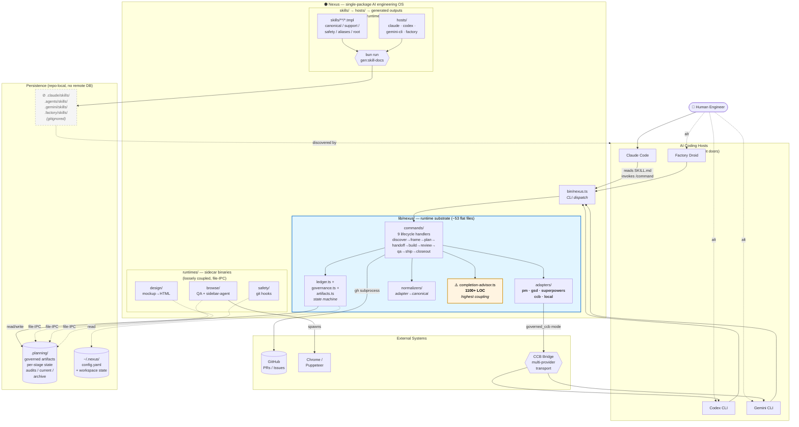

# Nexus Context Diagram

A high-level architectural view of Nexus, showing external actors, internal
substrate, sidecar runtimes, and the persistence boundary. Use this as a
single-glance reference when validating new design choices or onboarding a
contributor.

For component-level detail (file-by-file), see `lib/nexus/README.md`. For
work-in-progress remediation, see `docs/architecture/post-audit-cleanup-plan.md`.

---

## Diagram



---

## Layer model

### 1. Hosts (interactive front doors)

Claude / Codex / Gemini-CLI / Factory each load Nexus skill prose from a
host-specific install root (`.claude/skills/`, `.agents/skills/`,
`.gemini/skills/`, `.factory/skills/`). The host is the user's interactive
shell; it reads `SKILL.md` and invokes `bun run bin/nexus.ts <command>`. Hosts
do not extend lifecycle behavior — they are distribution targets.

### 2. CLI entry (`bin/nexus.ts`)

Resolves runtime cwd, reads `~/.nexus/config.yaml` to choose execution mode
(`governed_ccb` vs `local_provider`), dispatches to the appropriate command
handler in `lib/nexus/commands/`.

### 3. Runtime substrate (`lib/nexus/`)

Currently ~53 flat files plus six partial subdirectories. Logical concerns:

- **Lifecycle** (`commands/`) — one handler per stage; each reads ledger,
  asserts transition legality, calls adapters, normalizes output, writes
  artifacts, updates ledger.
- **Adapters** (`adapters/`) — five families: `pm`, `gsd`, `superpowers`
  (absorbed-pattern entries), `ccb`, `local` (transport entries). The default
  vs runtime distinction (`registry.ts`) is import-time only — see Risk #2.
- **State** (`ledger.ts`, `status.ts`, `artifacts.ts`) — primary persistence
  read/write boundary. All `.planning/` paths are constants here.
- **Governance** (`governance.ts`) — pure invariant assertion layer.
  Currently 26 identical throws — see Risk #2 in cleanup plan §2.6.
- **Normalizers** (`normalizers/`) — transform raw adapter output into
  canonical record shapes for persistence.
- **Cross-cutting** — `validation-helpers.ts`, `shell-quote.ts`,
  `execution-topology.ts`, `completion-advisor.ts` (the god module — see
  Risk #1).

### 4. Sidecar runtimes (`runtimes/`)

`browse/`, `design/`, `safety/` are compiled binaries with no TypeScript
import relationship to `lib/nexus/`. They communicate with the substrate via
filesystem queues and a localhost HTTP server (port 34567). The
`browse/sidebar-agent.ts` spawns `claude -p` and relays events.

### 5. Skill generation pipeline

Templates in `skills/**/*.tmpl` plus per-host configuration in `hosts/` are
compiled by `bun run gen:skill-docs --host <host>` into the host install
roots. Skill prose is **agent-facing instructions only** — it tells the host
how to call `bin/nexus.ts`. The runtime never reads the generated files.

### 6. Persistence

- `.planning/` — governed truth source, repo-local, git-tracked.
- `~/.nexus/config.yaml` — user-level execution preferences.
- Generated skill roots — gitignored, regenerated on every install/upgrade.

No database. No remote state store. Repo == single source of truth.

---

## Two execution modes

### `governed_ccb`

```
Human → Claude → Nexus → CCB → Codex/Gemini
```

Full multi-provider governed path. CCB is transport only; lifecycle and
governance still owned by Nexus. Used when `ccb claude codex gemini` is
mounted in a tmux session.

### `local_provider`

```
Human → Claude/Codex/Gemini → Nexus → local provider CLI
```

Single-host fallback. Nexus still owns the lifecycle. Local subagents
(`single_agent` / `subagents` / `multi_session`) configure how the local
provider fans out review and ship personas.

---

## Design risks observed at this snapshot

These are summarized here; each has (or will have) a tracked GitHub issue.

| # | Risk | Severity | When to fix |
|---|------|----------|-------------|
| 1 | `completion-advisor.ts` is a 1100+ LOC god module imported by every command handler | 🔴 High | **Now** — blocks Phase 4 ST1 |
| 2 | `governance.ts` has 26 identical `throw new Error('Run ledger is not canonical')` calls without discriminating codes | 🔴 High | Now — overlaps with PR #35 work |
| 3 | Single-child directories (`lib/`, `agents/openai.yaml`, `skills/root/`) and `runtimes/safety/` ↔ `skills/safety/` naming collision | 🟡 Medium | Phase 4 (already in cleanup plan ST2/ST5/ST7/ST8) |
| 4 | Default adapters can silently no-op in production code paths — no runtime kind check | 🟡 Medium | **Now** — low-cost, high-ROI |
| 5 | External skill scanner ignores Gemini-CLI and Factory host install roots | 🟢 Low | Now (small fix) |
| 6 | `.planning/` artifacts have no `schema_version` field — schema evolution has no detection point | 🟢 Low | Now (additive) |

## Two architectural choices that are right and worth preserving

1. **CCB as transport, not contract owner** — `lib/nexus/adapters/ccb.ts`
   is a thin wrapper. Nexus governance, lifecycle, artifacts have zero
   dependency on CCB. If CCB is unavailable, `local_provider` mode keeps
   the lifecycle intact. This separation should be defended on every PR
   that touches the adapter layer.
2. **`.planning/` as single source of truth** — no conversational state, no
   LLM memory dependency, all governed truth lands in git-visible files.
   `lib/nexus/` modules can be rebuilt at any commit and the work-unit state
   is reconstructible from `.planning/` alone. This is the project's core
   thesis: **transport is replaceable, truth is not**.

The 6 risks above are implementation-level concerns. They do not threaten
the thesis; they only erode it if left unaddressed.

---

## Maintenance

This document is generated from the codebase state at the time of writing
and should be re-validated whenever:

- A major lifecycle stage is added or removed
- A new sidecar runtime joins `runtimes/`
- A new host is supported in `hosts/`
- The execution-mode topology changes
- Significant Phase 4 cleanup lands

Re-render the Mermaid block in any GitHub or VS Code preview pane.
