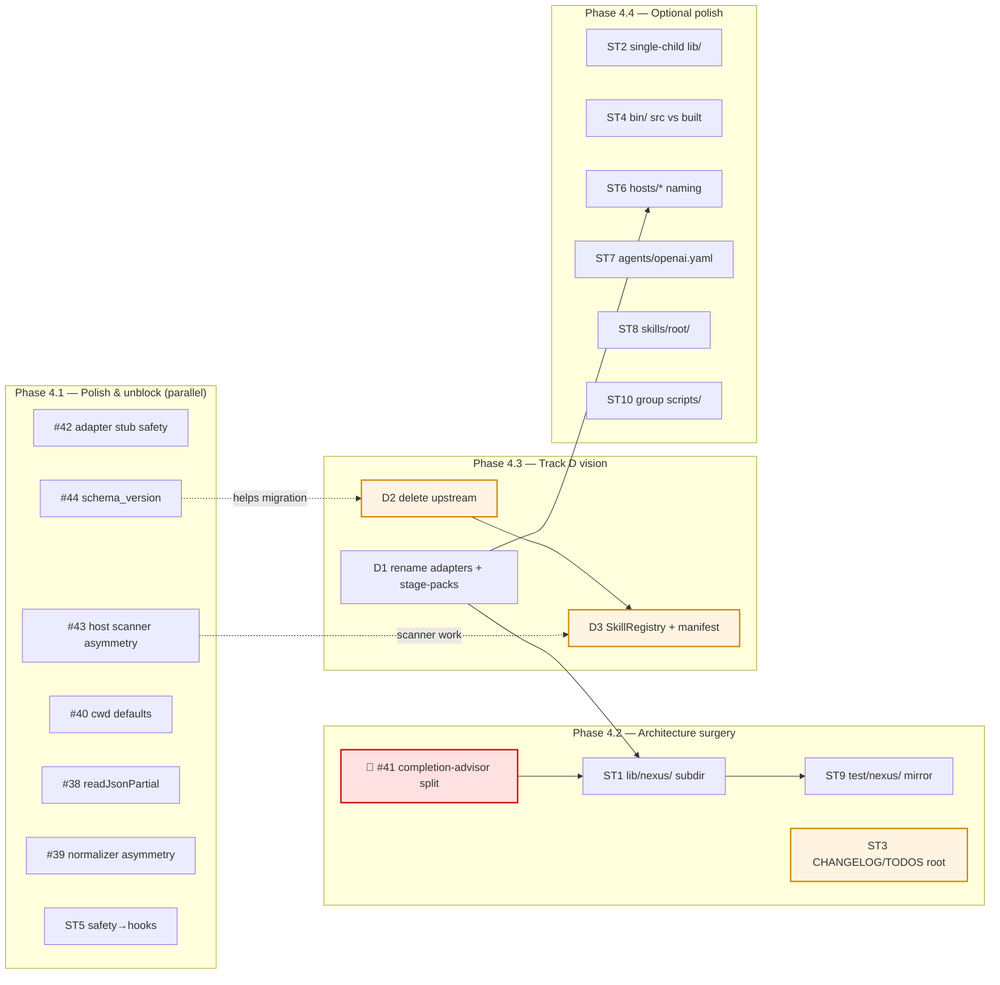

# Phase 4 Plan

**Status:** Active living document.
**Successor to:** `docs/architecture/post-audit-cleanup-plan.md` (Phases 1-3, now complete).
**Companion docs:**
- `docs/architecture/context-diagram.md` — system architecture overview + observed risks
- `docs/architecture/completion-advisor-split-proposal.md` — RFC for Issue #41 (blocks Phase 4.2)

---

## What changed

Phase 3 is complete in `main` (PRs #27, #28, #31, #32, #33, #34, #35 all merged on
2026-05-04). High-risk modules now have behavioral test coverage; the substrate
is safe to restructure. Phase 4 is unblocked.

This document supersedes the Phase 4 section of
`post-audit-cleanup-plan.md` by integrating four work tracks:

- **Track A** — Existing cleanup-plan ST items (ST1-ST10).
- **Track B** — Phase 3 review-derived follow-up issues (#38, #39, #40).
- **Track C** — Architecture-audit-derived design risks (#41, #42, #43, #44).
- **Track D** — The "fully internalize PM/GSD/Superpowers + intelligent skill
  cooperation" vision discussed during Phase 3 review.

---

## Goal

Phase 4 has two intertwined goals:

1. **Make the codebase legible** — eliminate god modules, name things by
   function instead of provenance, complete the structural moves blocked by
   Phase 3 test coverage.
2. **Realize the upstream-removal thesis** — finish absorbing PM Skill / GSD /
   Superpowers concepts as native Nexus capabilities, delete the upstream
   snapshots, and upgrade external-skill discovery into a first-class skill
   ecology.

Goal 1 is conservative completion. Goal 2 is transformative direction. Phase 4
sequences them so the cleanup unblocks the transformation.

---

## Scope inventory

### Track A — Existing cleanup-plan ST items

From `docs/architecture/post-audit-cleanup-plan.md` § Phase 4 code-shaped:

| ID | Item | Notes |
|----|------|-------|
| ST1 | Subdir `lib/nexus/` by concern | Implemented in Phase 4.4 structure PR (#82) |
| ST2 | Single-child directory `lib/` (only contains `lib/nexus/`) | Documented: keep `lib/nexus/` as namespace root (#83) |
| ST3 | Move `CHANGELOG.md` / `TODOS.md` out of repo root | Runtime artifacts; needs RFC for skill prose + resolver updates |
| ST4 | Split `bin/` source from built artifacts | Implemented: TypeScript sources live in `lib/nexus/cli/`; `bin/` keeps shims/binaries (#85) |
| ST5 | Rename hook helper runtime directory to `runtimes/hooks/` | Coordinated migration; install-path implications |
| ST6 | Standardize `hosts/*` naming | Tied to Track D D1 |
| ST7 | Decide on `agents/openai.yaml` (single-child) | Done: documented compatibility surface in `agents/README.md` |
| ST8 | Decide on `skills/root/` (single-child shape) | Done: documented root-entrypoint taxonomy in `skills/root/README.md` |
| ST9 | Mirror `test/nexus/` subdir | Moves alongside ST1 |
| ST10 | Optional: group `scripts/` | Done: grouped active entrypoints by concern |

### Track B — Phase 3 review follow-ups

| Issue | Title | Estimated effort |
|-------|-------|------------------|
| #38 | `deploy-contract: readJsonPartial collapses missing vs parse_error (companion to #37)` | ~1h |
| #39 | `deploy-contract: canonical JSON kind fields bypass normalizeTrigger/normalizeStatusKind` | ~1h |
| #40 | `lib/nexus: 3 helpers still default cwd to process.cwd() (PR #34 follow-up)` | ~1h |

### Track C — Architecture audit follow-ups

| Issue | Title | Estimated effort | Dependency |
|-------|-------|------------------|------------|
| #41 | `architecture: completion-advisor.ts has grown to 1452 LOC — split into resolver + writer` | ~5h, multi-phase | RFC ready; **blocks ST1** |
| #42 | `architecture: default adapters can silently no-op in production code paths` | ~30 min | None |
| #43 | `lib/nexus: external-skills scanner and skill-check ignore Gemini and Factory host install paths` | ~1h | Touches Track D scanner work |
| #44 | `lib/nexus: persisted .planning/ artifacts have no schema_version field` | ~2h | Important for Track D D2 migration |

### Track D — Upstream removal + skill ecology vision

Four sub-tracks (each is its own chunk of work, not a single PR):

#### D1 — Rename adapters by lifecycle role
- `lib/nexus/adapters/pm.ts` → `discovery.ts` (used by `/discover`, `/frame`)
- `lib/nexus/adapters/gsd.ts` → `planning.ts` (used by `/plan`, `/handoff`)
- `lib/nexus/adapters/superpowers.ts` → `execution.ts` (used by `/build`, `/review`, `/qa`, `/ship`, `/closeout`)
- Reorganize `lib/nexus/stage-packs/{pm,gsd,superpowers}/` → `stage-packs/{discover,plan,build}/`
- Drop legacy upstream provenance framing in `README.md`

Estimated: ~3-4h, low risk (cosmetic rename + grep-replace, no behavior change).

#### D2 — Delete upstream snapshots and absorption surface

**Status: complete.** The approved RFC lives at
`docs/architecture/track-d-d2-rfc.md`; implementation has removed the upstream
maintenance modules, absorption surface, upstream release gate, and vendored
snapshot roots.

Completed removals and simplifications:
- `vendor/upstream/` — 1231 files (all PM/GSD/Superpowers snapshots)
- `vendor/upstream-notes/` — lockfile + source maps
- `lib/nexus/absorption/` — entire module (9 files)
- `lib/nexus/upstream-maintenance.ts`
- `lib/nexus/upstream-compat.ts`
- `lib/nexus/maintainer-loop.ts`
- `release_channel` now points at Nexus release manifests
- `bun run skill:check` no longer validates upstream-vs-generated mapping

RFC decisions resolved:
- Vendored installs continue through Nexus release-based upgrade paths.
- `release_channel` keeps existing config shape while dropping upstream lockfile coupling.
- `skill:check` stays focused on Nexus-owned generated surfaces.

Completed across D2 Phase 2.1 through Phase 2.5.

#### D3 — Skill ecology v2

**RFC approved.** See `docs/architecture/track-d-d3-rfc.md` for the current
skill ecology model and remaining implementation phases.

Three candidate routing models (must pick one or a hybrid):
- **A — Advisor-only** (current behavior): scan installed skills, surface as `recommended_external_skills` in completion-advisor records, host displays. Low ROI to fix; already works.
- **B — Router-aware lifecycle**: stage handlers see external skills as candidates for "next action" suggestions; richer manifest required.
- **C — Intent-first routing**: `/nexus do <意图>` dispatches to canonical / external / refuse based on LLM-classified intent. New product surface.

**Recommendation: B + optional C** — keep governed lifecycle as the truth source, add C as an entry-point dispatcher.

Components:
- `SkillRegistry` (new) — replaces and supersets `lib/nexus/external-skills.ts`
- Skill manifest schema — extend `SKILL.md` frontmatter or add `nexus.skill.yaml`
- (If C) Intent classifier — LLM call at `/nexus do` entry; result is non-governed advice that the user accepts to enter governed lifecycle

Estimated: ~15-20h once RFC + decisions are settled.

#### D4 — Lifecycle stage hooks for user skills (long-term, optional)

Allow user-installed skills to inject behavior at lifecycle stage boundaries (e.g., `figma-implement-design` runs after `/build` completes). Out of scope for the initial Phase 4 push; revisit after D3 is in production.

---

## Dependency graph

---

## Phasing

### Phase 4.1 — Polish & unblock

**Goal:** Land all the small, ready-to-go fixes so the queue is clean before
larger architectural moves.

**Work (all can be Codex-delegated, mostly parallel):**

| Item | Effort | Has design doc? |
|------|--------|-----------------|
| #42 adapter stub kind marker + production assertion | 30 min | Issue body contains proposal |
| #44 `schema_version: 1` field on canonical artifacts | 2h | Issue body contains proposal |
| #43 `HOST_INSTALL_ROOTS` constant + global migration | 1h | Issue body contains proposal |
| #40 Three remaining `process.cwd()` defaults | 1h | Issue body inventoried |
| #38 + #39 deploy-contract follow-ups (single PR) | 2h | Issue bodies contain fixes |
| ST5 hook helper runtime rename to `runtimes/hooks/` | 1h | Cleanup plan §Phase 4 ST5 |

**Total: ~6-8h. Suggested as a single batched Codex round (multiple PRs in
parallel since they touch different modules).**

**Exit criteria:**
- All 7 follow-up issues either closed or scoped down to "out of Phase 4".
- `runtimes/hooks/` exists; the legacy safety-named runtime directory is removed.
- Repo backlog ≤ 3 open issues, each in design (RFC) or future-work state.

### Phase 4.2 — Architecture surgery

**Goal:** Make `lib/nexus/` legible by concern, not by chronology of accumulation.

**Order:**

1. **#41 completion-advisor split**
   - Phase 1: extract `writer.ts` (~80 LOC, all 8 callers update one import)
   - Phase 2: extract `resolver.ts` (~1300 LOC mechanical)
   - Phase 3: mirror tests
   - Detail: see `docs/architecture/completion-advisor-split-proposal.md`

2. **ST1 + ST9 lib/nexus/ subdir + test/nexus/ mirror**
   - Group by concern (commands / adapters / persistence / governance / cross-cutting)
   - 50+ import path changes across `lib/`, `bin/`, `runtimes/`, `test/`
   - Land as a single mechanical PR after #41 lands

3. **ST3 CHANGELOG/TODOS root cleanup (RFC required)**
   - These files are runtime artifacts referenced by:
     - `~12 SKILL.md.tmpl` files
     - 3 resolver files in `scripts/resolvers/`
     - `lib/nexus/repo-taxonomy.ts` `ROOT_FILES`
   - RFC must address: target location, resolver migration, skill prose updates, generated SKILL.md regeneration order

**Total: ~15-20h. Should land as 3-4 PRs (one per item, or split #41 into its 3 phases).**

**Exit criteria:**
- `lib/nexus/completion-advisor/` exists; `completion-advisor.ts` deleted.
- `lib/nexus/{commands,adapters,persistence,governance,...}` subdirs exist.
- `test/nexus/` mirrors the new structure.
- `CHANGELOG.md` and `TODOS.md` no longer at repo root; resolver pipeline updated.

### Phase 4.3 — Track D: Remove upstream + Skill ecology v2

**Goal:** Realize the "fully internalize PM/GSD/Superpowers + intelligent skill
cooperation" vision.

#### Order

1. **D1 — Rename adapters and stage-packs (low risk, do now)**
   - `adapters/{pm,gsd,superpowers}.ts` → `{discovery,planning,execution}.ts`
   - `stage-packs/{pm,gsd,superpowers}/` → `{discover,plan,build}/`
   - README copy edits
   - Combine with ST6 (hosts/* naming) since both are renamings
   - **No RFC needed** — pure rename + grep-replace + tests
   - Effort: ~3-4h

2. **D2 — Delete upstream (complete)**
   - RFC approved in `docs/architecture/track-d-d2-rfc.md`
   - `release_channel` simplified to Nexus release manifests
   - `skill:check` no longer validates upstream snapshot mappings
   - `lib/nexus/absorption/`, upstream maintenance modules, upstream release
     gates, `vendor/upstream/`, and `vendor/upstream-notes/` removed
   - Phase 2.5 docs rewrite removed upstream provenance framing from active docs

3. **D3 — Skill ecology v2 (RFC approved; implementation in progress)**
   - Follow `docs/architecture/track-d-d3-rfc.md`
   - RFC answers:
     - **Decision 2:** Routing model — A / B / C / B+C hybrid (recommendation: B + optional C)
     - **Decision 4:** Manifest format — extended frontmatter vs `nexus.skill.yaml`
     - SkillRegistry API surface
     - Backwards compatibility with current `external-skills.ts` callers
   - Implementation: SkillRegistry, manifest schema, scanner upgrade
   - (If C decided) `/nexus do <intent>` dispatcher
   - Effort: ~15-20h after RFC + decisions

**Total: ~30-40h across 3 sub-tracks. Spans multiple weeks.**

**Exit criteria:**
- `vendor/upstream*/` directories removed.
- No legacy upstream provenance framing in `README.md`, `lib/nexus/`, or stage-pack source.
- `adapters/{discovery,planning,execution}.ts` (renamed) exist.
- SkillRegistry exports replace `external-skills.ts`.
- `recommended_external_skills` records carry richer metadata (lifecycle stage,
  triggers, inputs/outputs).
- (If C is implemented) `bun run bin/nexus.ts do <intent>` works end-to-end.

### Phase 4.4 — Optional polish (background work)

These can be done at any time during 4.1-4.3 as filler:

- ST2 `lib/` single-child decision (drop, fold, or document)
- ST4 split `bin/` source from built artifacts
- ST6 standardize `hosts/*` naming (combine with D1)
- ST7 documented `agents/openai.yaml` compatibility surface
- ST8 documented `skills/root/` root-entrypoint taxonomy
- ST10 grouped active `scripts/` entrypoints

Each is independently small (≤2h). Bundle 2-3 into Codex batches when
opportunity allows.

---

## Decision points (open)

These need explicit answers before Phase 4.3 starts.

### Decision 1: Phase 4 strategic intent

| Option | Description | Trade-off |
|--------|-------------|-----------|
| Path A | Only complete Track A (cleanup ST1-ST10) | Conservative; finishes existing roadmap; defers strategic shift |
| Path B | Skip Track A, jump to Track D | Transformative; faster realization of vision; leaves cleanup debt |
| **Path C** | **Interleave: 4.1 → 4.2 → D1 → 4.3 D2/D3** | **Recommended** — cleanup unblocks transformation, transformation simplifies what cleanup left |

### Decision 2: D3 skill router model (depth)

| Option | Description |
|--------|-------------|
| A | Advisor-only (current behavior, just polish) |
| **B** | **Router-aware lifecycle (recommended baseline)** |
| C | Intent-first routing (`/nexus do <意图>`) — additional surface |

Recommendation: **B + optional C**. B preserves governed truth model; C is a thin
LLM-classifier dispatcher in front of governed lifecycle.

### Decision 3: D4 skill manifest format

| Option | Description |
|--------|-------------|
| Extended frontmatter | Add `applies_to.lifecycle_stages`, `triggers`, `inputs_from`, `outputs_to` to existing `SKILL.md` frontmatter |
| Separate `nexus.skill.yaml` | New file alongside `SKILL.md` for Nexus-specific metadata |

Trade-off: extended frontmatter is lower friction for skill authors; separate
file gives cleaner schema evolution.

### Decision 4: RFC sequencing

| Option | Description |
|--------|-------------|
| RFC-first | Write D2 RFC + D3 RFC before any Track D code lands |
| **RFC-as-you-go** | **Write D2 RFC before D2 code; write D3 RFC concurrently with D1 implementation** |

Recommendation: **RFC-as-you-go**, but D2 RFC must be written and approved before
any deletion in `vendor/upstream/`.

---

## Tracking

This document is the source of truth for Phase 4. Updates land via PR review.

Each sub-phase ships as one or more PRs that explicitly reference this plan in
the PR description. Mark items as ☑ here when their PR merges.

### Phase 4.1 — Polish & unblock
- [x] #42 adapter stub safety (PR #45 landed)
- [x] #44 `schema_version` field (PR #47 landed; ledger schema versioning live)
- [x] #43 host scanner asymmetry (PR #47 landed; `HOST_SKILL_INSTALL_ROOTS` registry)
- [x] #40 three cwd defaults (PR #55 landed)
- [x] #38 + #39 deploy-contract follow-ups (PR #55 landed)
- [x] ST5 hook helper runtime rename to `runtimes/hooks/` (PR #56 landed)
- [ ] #48 PR #45 follow-up (parameterize stub-rejection test) — assigned glaocon
- [ ] #49 PR #47 follow-up (schema_version reader symmetry) — assigned glaocon

### Phase 4.2 — Architecture surgery
- [~] #41 completion-advisor split — Phase 1 done (PR #51 — writer extracted); Phase 2 in flight (#63); Phase 3 queued (#72)
- [x] ST1 lib/nexus/ subdir — concern buckets documented in `phase-4-structure-brief.md` (#82)
- [x] ST9 test/nexus/ mirror — concern buckets mirror runtime layout (#82)
- [x] ST3 CHANGELOG/TODOS root cleanup (#84) — RFC done; decision: stay in root

### Phase 4.3 — Track D
- [x] D1 rename adapters + stage-packs (+ ST6) — PR #50 landed
- [x] D2 RFC written and approved (`track-d-d2-rfc.md` v1; revised 2026-05-05 with Phase 2.5 audit additions)
- [x] D2 implementation — Phases 2.1-2.5 complete (#58, #62, #69, #70, #71)
- [x] D3 RFC written and approved (`track-d-d3-rfc.md` v1; revised 2026-05-05 v2 with Model γ + Δ1/Δ2 sub-phases)
- [~] D3 implementation — Phase 1 done (PR #57 + #60); Phase 2.a in flight (#65); 2.b/2.c/2.d/3-7 queued (#74-#81)
- [ ] D3 optional intent dispatcher (`/nexus do`) — queued as Phase 3.5 (#79)

### Phase 4.4 — Optional polish
- [x] ST1+ST9 bundled (#82) — concern split + test mirror complete
- [x] ST2 lib/ single-child (#83) — documented keep decision
- [x] ST3 CHANGELOG/TODOS (#84) — RFC done; **decision: stay in root** (`track-c-st3-rfc.md`); doc note added to `repo-taxonomy-v2.md`
- [x] ST4 split bin/ (#85) — TypeScript sources moved to `lib/nexus/cli/`
- [x] ST7 agents/openai.yaml (#86) - documented compatibility-only surface
- [x] ST8 skills/root single-child (#87) - documented root-entrypoint taxonomy
- [x] ST10 group scripts/ (#88) - grouped active script entrypoints
- [ ] Doc refresh: context-diagram.md (#89) — post-D2
- [ ] Doc refresh: repo-taxonomy-v2.md (#90) — post-D2

**Legend:** `[x]` done · `[~]` in flight (some sub-tasks done) · `[ ]` not started

**Cross-reference:** See `docs/architecture/phase-4-backlog.md` for the live
issue tracker view (priorities, dependencies, assignment policy).

---

## References

- `docs/architecture/post-audit-cleanup-plan.md` — Phases 1-3 origin and ST list
- `docs/architecture/context-diagram.md` — system architecture overview, design risks
- `docs/architecture/completion-advisor-split-proposal.md` — RFC for #41
- `docs/architecture/track-d-d2-rfc.md` — approved D2 removal RFC
- `docs/architecture/track-d-d3-rfc.md` — approved D3 skill ecology RFC
- Open issues: #38, #39, #40, #41, #42, #43, #44
