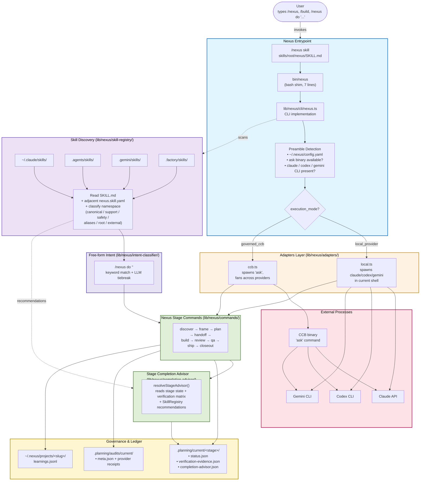

# Nexus Runtime Flow

How a single invocation flows from the user typing `/nexus`, `/build`, or
`/nexus do "..."` all the way through Nexus's runtime substrate to provider
calls and governed artifact writes.

Companion to `context-diagram.md` (layered system view) and
`lib/nexus/README.md` (concern-bucket map). This document focuses on the
**execution path** — what code runs in what order — rather than the static
component layout.

---

## Diagram

---

## Flow Narrative

### 1. Entry

The user types a slash-command in a host (Claude / Codex / Gemini CLI / Factory).
The host loads the matching SKILL.md prose and follows its instruction:
`bun run ./bin/nexus <command>`.

`bin/nexus` is a 7-line bash shim that `exec`s
`bun run lib/nexus/cli/nexus.ts "$@"`. The shim exists so the
`#!/usr/bin/env bash` line stays stable while the TypeScript entry point can
move under the concern-based `lib/nexus/cli/` bucket.

### 2. Preamble Detection

`lib/nexus/cli/nexus.ts` reads `~/.nexus/config.yaml` and probes the
environment to determine `execution_mode`:

- **`governed_ccb`** — CCB is mounted, `ask` binary is available, and at least
  one provider (Codex / Gemini) is reachable through CCB.
- **`local_provider`** — fall back to the host's own provider CLI in the
  current shell.

### 3. Adapter Selection

Based on `execution_mode`, Nexus picks one of:

- **`adapters/local.ts`** — spawns `claude` / `codex` / `gemini` directly in
  the current shell. Used when CCB is unavailable or when the host is
  intentionally single-provider.
- **`adapters/ccb.ts`** — spawns `ask` and fans the request across configured
  providers (typically Codex + Gemini for governed review). CCB owns the
  multi-provider transport; Nexus owns the lifecycle decision.

### 4. Skill Discovery (parallel side effect)

While the adapter is being selected, `lib/nexus/skill-registry/` scans the
four installed host skill roots (`~/.claude/skills/`, `.agents/skills/`,
`.gemini/skills/`, `.factory/skills/`). For each `SKILL.md` found, it parses
any adjacent `nexus.skill.yaml` manifest, then classifies the skill into one
of six namespaces.

### 5. Lifecycle Dispatch

If the user invoked a canonical stage (`/build`, `/review`, etc.), the
adapter dispatches directly to the matching handler in
`lib/nexus/commands/`. If the user invoked `/nexus do "<intent>"`,
`lib/nexus/intent-classifier/` runs a keyword match plus an optional LLM
tiebreak against the discovered skill set and recommends a canonical
command.

### 6. Stage Execution

Each lifecycle command (`discover`, `frame`, `plan`, `handoff`, `build`,
`review`, `qa`, `ship`, `closeout`) reads its required upstream artifacts,
calls the adapter to fan out provider work, and writes its outputs back to
`.planning/`.

### 7. Completion Advisor

After each canonical stage finishes, `lib/nexus/completion-advisor/`'s
`resolveStageAdvisor()` reads the stage status, the verification matrix,
and the SkillRegistry recommendations to produce
`.planning/current/<stage>/completion-advisor.json` — the runtime-owned
"what should happen next" contract that interactive hosts consume.

### 8. Persistence

Three artifact families are written by the lifecycle:

- `.planning/current/<stage>/` — per-stage status, evidence, advisor
- `.planning/audits/current/` — review audit set + provider receipts
- `~/.nexus/projects/<slug>/learnings.jsonl` — accumulated learnings

All other state is derived from these or from `~/.nexus/config.yaml`. No
remote database, no conversational state store.

---

## Mode Comparison

| Aspect | `governed_ccb` | `local_provider` |
|---|---|---|
| Transport | CCB (`ask`) | Direct provider CLI |
| Multi-provider | Yes (Codex + Gemini in review) | No |
| Fallback when ask unavailable | Refuses or downgrades | Default mode |
| Governance | Same | Same — Nexus owns lifecycle either way |

CCB is **transport**, not contract owner. If CCB is unreachable, the
lifecycle still runs through `local_provider`. `.planning/` is the source
of truth in both modes.

---

## Differences from the Earlier (pre-Phase-4) Flow Diagram

If you have a copy of the early-2026 runtime flow diagram in your notes,
these are the five places it has drifted:

| Pre-Phase-4 box | Current location | When it changed |
|---|---|---|
| `bin/nexus.ts` | `lib/nexus/cli/nexus.ts` (+ `bin/nexus` bash shim) | PR #137 (Phase 4.4 ST4) |
| `lib/nexus/external-skills.ts` | `lib/nexus/skill-registry/` (8-file directory) | Track D-D3 Phase 1 |
| Flat `lib/nexus/` | 18 concern-based subdirectories | PR #137 (Phase 4.4 ST1) |
| (no `/nexus do`) | `lib/nexus/intent-classifier/` + `commands/do.ts` | Track D-D3 Phase 5 |
| (no completion advisor) | `lib/nexus/completion-advisor/` writing `completion-advisor.json` | Track D-D3 Phase 3 |

---

## Maintenance

Re-validate this diagram whenever:

- A lifecycle stage is added, removed, or renamed.
- A new execution mode joins the `Mode?` branch.
- An adapter is added (a new provider integration that's not local or CCB).
- `lib/nexus/cli/nexus.ts` or `bin/nexus` is restructured.
- `lib/nexus/intent-classifier/` or `lib/nexus/completion-advisor/` changes
  its public contract.
- A new artifact family is added to `.planning/` or `~/.nexus/`.

Companion docs to check during the same review:

- `context-diagram.md` — layered system view (hosts ↔ Nexus ↔ persistence)
- `lib/nexus/README.md` — 18-bucket concern map
- `docs/architecture/repo-taxonomy-v2.md` — repository-level path taxonomy
