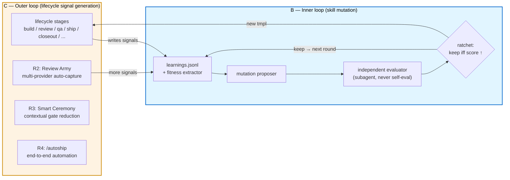

# Design: Nexus Self-Learning V1 (Meta-Spec)

> **Generated by:** /learn polish brainstorming, 2026-05-11
> **Status:** ACTIVE (living reference, not a contract)
> **Predecessor:** `docs/designs/SELF_LEARNING_V0.md`
> **Related audits:** `docs/architecture/skill-strength-audit-v4-darwin-post-track-f.md`
> **External inspiration:** `alchaincyf/darwin-skill` (8-dimension rubric, ratchet, independent-evaluator pattern)

## §1 Status snapshot

As of 2026-05-11:

- **R1 of SELF_LEARNING_V0 shipped** — `learnings.jsonl` + `/learn` + 8 skills bound by Iron Law 2 capture discipline.
- **Track F absorbed darwin-skill's framework manually** — the canonical 9 skills lifted from a 73.1 → 86.0 mean under the 8-dimension weighted rubric. v4 audit verdict: *"marginal returns now... no obvious Track G shape from this audit alone."*
- **R2 through R5 untouched** — Review Army, Smart Ceremony, `/autoship`, Studio are all still paper.
- **Untapped: learnings-as-fitness-function.** darwin-skill uses synthetic `test-prompts.json`. Nexus has accumulated real `learnings.jsonl` signal that nothing currently consumes for skill curation.

This meta-spec frames the work of **(B)** using accumulated learnings as a fitness signal, plus **(C)** extending the lifecycle self-learning loop along the SELF_LEARNING_V0 roadmap.

## §2 Why a meta-spec, not a single design

B + C combined is **five sub-projects** with partial ordering and three load-bearing seams. A single spec would either be too large to validate or too thin to drive any individual sub-project. This document is the **dependency map and seam analysis**, not a design — each sub-project gets its own `brainstorm → spec → plan → execute` cycle when its trigger fires.

**This doc is reference, not contract.** Sub-project specs are contracts.

## §3 Two-loop model

**Frequency asymmetry**:

- **C runs every session.** Every lifecycle-stage execution produces signal. Today: 8 capture-bound skills. Tomorrow (R2+): more.
- **B runs weekly to quarterly.** It consumes accumulated signal and proposes targeted mutations.

C is the *signal generator*. B is the *signal consumer*. Both share `learnings.jsonl` as the bus.

## §4 Five sub-projects

| # | Name | Purpose | Deps | Trigger |
|---|---|---|---|---|
| **SP1** | **Signal Architecture** | Evolve `learnings.jsonl` schema + cross-skill capture conventions to support both B and C | none | **now** (no precondition) |
| **SP2** | **Fitness Function** | Translate `learnings.jsonl` into a per-skill darwin-compatible score | SP1 lands | SP1 lands |
| **SP3** | **Mutation Harness** | Propose → independent eval → ratchet keep/revert for `.tmpl` edits | SP2 + Seam 2 decision | SP2 lands + governance tier decided |
| **SP4** | **R2 Review Army** | Multi-provider auto-capture during `/review` | SP1 (schema) | SP1 lands (parallel to SP2/SP3) |
| **SP5** | **R3 Smart Ceremony** | Contextual gate reduction; must follow B | SP3 + ≥6 months of B operation | SP3 lands + 6mo data |

Status: all 5 **not started**.

## §5 Three seams

Each seam is a load-bearing decision that doesn't get answered until the relevant sub-project spec opens. The "current tilt" is the default this meta-spec recommends; the "evidence to flip" is the signal that should re-open the question.

### Seam 1 — Feedback amplification (most dangerous)

**Risk:** Endogenous fitness function (B mutates → C captures signals about mutated behavior → B re-mutates against signals about its own work) creates an echo chamber. darwin-skill avoids this with frozen `test-prompts.json`; Nexus loses that property if it goes pure learnings-as-fitness.

**Current tilt:** **Holdout corpus.** Freeze a reference subset of learnings as a non-evolving scoring set. New captures feed proposals but don't replace the holdout.

**Evidence to flip:** Holdout corpus stagnating (diversity decay measured over 6 months). If observed, shift to **pre-mutation baseline snapshots** — each mutation must beat the score from immediately before it, not a stale frozen set.

### Seam 2 — Governance ownership (most violates Nexus character)

**Risk:** B's auto-mutate conflicts with Nexus's "repo-visible governance is truth" axiom. `SKILL.md.tmpl` is source code; code changes go through `/build → /review → /qa → /ship`. Routing every mutation through the full pipeline kills automation; bypassing it kills governance.

**Current tilt:** **Tier-based governance.** Frontmatter / examples / typical prompts = auto-commit (low blast radius). Workflow steps / Iron Laws / artifact contracts = mandatory `/build` pipeline (high blast radius). Intermediate elements (e.g., AskUserQuestion gates) classified case-by-case in SP3 spec.

**Evidence to flip:** Any auto-tier mutation produces a downstream runtime regression detectable through SP1's signal architecture. If observed, tighten to **shadow branch + quarterly batch PR** (every mutation human-reviewed).

### Seam 3 — R3 ↔ B sequencing

**Risk:** R3 (Smart Ceremony) reduces gates; B needs gates as the audit lane for safe auto-landed mutations. If R3 lands first, B must invent its own governance from scratch.

**Current tilt:** **B strictly before R3.** SP5 cannot start until SP3 has shipped and accumulated ≥6 months of operation data.

**Evidence to flip:** R3 demand emerges from a different driver (e.g., user complaints about ceremony in `/qa` or `/ship`) before B materializes. In that case, R3 lands first; B builds its own audit lane later, accepting higher complexity.

## §6 Sequencing recommendation

1. **SP1 first.** Common foundation, independent value, doesn't touch any seam.
2. **SP2 + SP4 in parallel** after SP1. B branch and C branch don't share code, only schema.
3. **SP3 after SP2.** Needs fitness function + Seam 2 decision.
4. **SP5 last**, deferred ≥6mo after SP3 ships.

## §7 Non-goals (this meta-spec does not decide)

- The specific `learnings.jsonl` schema changes (SP1 decides).
- Whether B becomes a new skill `/evolve` or extends `/learn` (SP3 decides).
- Tier boundaries for Seam 2 (SP3 decides, after the seam-2 question is answered).
- Provider topology for Review Army — sequential vs parallel CCB fan-out (SP4 decides).
- Whether to contribute back to `alchaincyf/darwin-skill` upstream (out of scope; revisit if SP3 produces generally-useful tooling).
- Whether the v4 audit's "no obvious Track G" verdict is wrong (this meta-spec accepts it; SP3 results may revisit if mutation-driven lifts exceed manual Track F lifts).
- Polishing `/learn`'s own SKILL.md (already 80.3 in v4 audit; out of B+C scope).

## §8 Open questions per sub-project

Only the questions that **must be answered or the sub-project's spec cannot proceed**.

| SP | Open question |
|---|---|
| SP1 | Does an entry need `subject_skill` separately from `skill` (writer vs subject)? |
| SP1 | How are 3-strike cross-skill clusters represented as a first-class object, not just N rows? |
| SP1 | Is `confidence` enough, or is `evidence_strength` a distinct second axis? |
| SP2 | What is the mapping function from {pitfall density, contradiction rate, low-confidence aging, capture latency} to a 0–100 fitness score? |
| SP2 | Does fitness *combine with* the darwin 8-dimension rubric, or *replace* D8 (Real-World Performance) only? |
| SP2 | Per-skill granularity, or per-tmpl-section granularity? |
| SP3 | Mutation proposer and evaluator: same provider, or governed CCB cross-provider (e.g., Claude proposes, Codex evaluates)? |
| SP3 | Where does mutation work happen — main, shadow branch, or fully through governed `/build`? |
| SP3 | How does the ratchet interact with multi-host generation (4 hosts × 1 tmpl = 4 generated outputs)? |
| SP4 | Multi-provider review fan-out: parallel or sequential? |
| SP4 | How are conflicting findings reconciled before sinking to `learnings.jsonl`? |
| SP4 | Does Review Army change `/review`'s artifact contract or only extend it? |
| SP5 | Which existing gates are candidates for contextual reduction? |
| SP5 | What is the safe-reduction rule (e.g., "≥90 days with no findings caught at this gate")? |
| SP5 | How does R3 interact with B's audit-lane dependencies inherited from SP3? |

## §9 Adjust-as-reality-bites

This is a **living document**. The following signals are explicit triggers to revise it:

- **SP1 ships** → §3 diagram updated to reflect actual signal schema; §4 status column updated.
- **Any seam's "evidence to flip" observed** → §5 entry rewritten; downstream sub-projects re-evaluated for ripple impact.
- **A sub-project's brainstorm discovers a missing 6th sub-project** → §4 + §6 + §8 updated.
- **A different audit framework (post-darwin, e.g. Track G) emerges from an unrelated angle** → entire meta-spec may be obsoleted in favor of the new framework. Archive this doc as historical context.
- **Quarterly check (next: 2026-08-11)** — even with no triggers fired, scan for staleness; prune or update.

Sub-project specs override this meta-spec at the seams they touch. This doc is reference; specs are contracts.

## §10 Maintenance

- **Linked from** `docs/designs/SELF_LEARNING_V0.md` (R1 ↔ V1 continuation).
- **Updated when** each sub-project spec lands — at minimum, the status and trigger columns in §4.
- **Archived to** `docs/architecture/` when all 5 sub-projects ship or this meta-spec is superseded by a Track-G-class framework.
