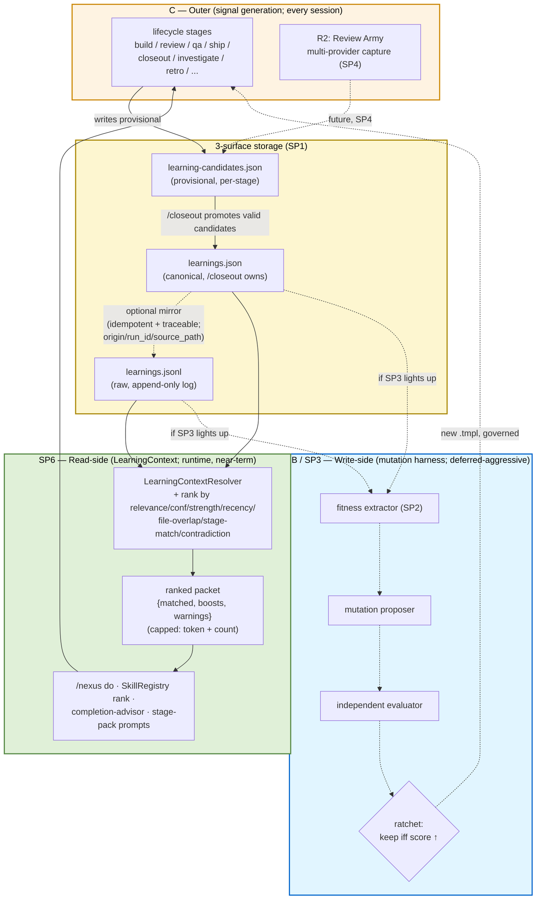

# Design: Nexus Self-Learning V1 (Meta-Spec)

> **Generated by:** /learn polish brainstorming, 2026-05-11
> **Last revised:** 2026-05-11 (v2 — second collaborator review consumed; see §9)
> **Status:** ACTIVE (living reference, not a contract)
> **Predecessor:** `docs/designs/SELF_LEARNING_V0.md`
> **Related audits:** `docs/architecture/skill-strength-audit-v4-darwin-post-track-f.md`
> **External inspiration:** `alchaincyf/darwin-skill` (8-dimension rubric, ratchet, independent-evaluator pattern)
> **External reviews consumed:**
> - glaocon, "Verdict on learning loop design", 2026-05-11 — proposes read-only `LearningContext` layer (see §4 SP6 and §5 Seam 2)
> - glaocon, "learning loop design META v1 feedback", 2026-05-11 — 5-issue feedback on V1_META v1 (see §3 diagram, §3 mirroring, §4 SP5/SP6, §5 Seam 3, §6 sequencing, §8 evidence_strength re-opened)

## §1 Status snapshot

As of 2026-05-11:

- **R1 of SELF_LEARNING_V0 shipped** — `learnings.jsonl` + `/learn` + 8 skills bound by Iron Law 2 capture discipline.
- **Track F absorbed darwin-skill's framework manually** — the canonical 9 skills lifted from a 73.1 → 86.0 mean under the 8-dimension weighted rubric. v4 audit verdict: *"marginal returns now... no obvious Track G shape from this audit alone."*
- **R2 through R5 untouched** — Review Army, Smart Ceremony, `/autoship`, Studio are all still paper.
- **Untapped: learnings-as-fitness-function.** darwin-skill uses synthetic `test-prompts.json`. Nexus has accumulated real `learnings.jsonl` signal that nothing currently consumes for skill curation.

This meta-spec frames the work of **(B)** using accumulated learnings as a fitness signal, plus **(C)** extending the lifecycle self-learning loop along the SELF_LEARNING_V0 roadmap.

## §2 Why a meta-spec, not a single design

B + C combined is **six sub-projects** with partial ordering and three load-bearing seams. A single spec would either be too large to validate or too thin to drive any individual sub-project. This document is the **dependency map and seam analysis**, not a design — each sub-project gets its own `brainstorm → spec → plan → execute` cycle when its trigger fires.

**This doc is reference, not contract.** Sub-project specs are contracts.

## §3 Three-loop model

Solid arrows = near-term path (SP1 → SP6). Dotted arrows = future / conditional (SP4 capture extension; SP3 mutation harness if it lights up; canonical→jsonl mirror is optional).

**Three loops, three cadences:**

- **C (outer) runs every session.** Lifecycle stages write provisional learning candidates. Today: 2 skills capture (`/investigate`, `/retro`). SP1 closes 6 more.
- **SP6 (read-side) runs every invocation.** LearningContextResolver biases routing at runtime as **boosts, not overrides**. Bounded packet (token + count cap). No artifact mutation.
- **B / SP3 (write-side) deferred.** Only lights up if SP6 stable ≥6mo and read-side bias proves insufficient (see §5 Seam 2).

**3-surface storage model** (glaocon verdict, adopted 2026-05-11):

- `~/.nexus/projects/<slug>/learnings.jsonl` — raw append-only operational memory log.
- `.planning/current/<stage>/learning-candidates.json` — **provisional** stage-attached candidates written during stage execution. Not yet governed.
- `.planning/current/closeout/learnings.json` — **canonical** governed run learnings, written only by `/closeout`. **Optional mirror** back into `learnings.jsonl` with explicit constraints: must be idempotent (re-mirroring the same canonical entry produces no duplicates) and traceable (each mirrored entry carries `origin: closeout`, `run_id`, and `source_path`). Operator-configurable per-run; mirroring without these guarantees is rejected.

The "Signal" node in the diagram above is shorthand for all three; SP1 specifies the schema across them.

## §4 Six sub-projects

| # | Name | Purpose | Deps | Trigger |
|---|---|---|---|---|
| **SP1** | **Signal Architecture** | Evolve `learnings.jsonl` schema + cross-skill capture conventions; introduce `learning-candidates.json` provisional layer. Schema additions (per glaocon verdict): `subject_skill`, `subject_stage`, `evidence_type`, `cluster_id`, `supersedes`, `last_applied_at`. Possibly +1 (`evidence_strength` or derived) — pending SP1 spec resolution of re-opened question (see §8). | none | **now** (no precondition) |
| **SP2** | **Fitness Function** | Translate `learnings.jsonl` + canonical learnings into a per-skill darwin-compatible score | SP6 lands (per glaocon V1 feedback: SP2 follows SP6, not parallel) | SP6 ships to production |
| **SP3** | **Mutation Harness** | Propose → independent eval → ratchet keep/revert for `.tmpl` edits | SP2 + Seam 2 decision + SP6 stable | SP6 stable ≥6mo + SP2 lands + governance tier decided |
| **SP4** | **R2 Review Army** | Multi-provider auto-capture during `/review` | SP1 (schema) | SP1 lands (parallel to SP6) |
| **SP5** | **R3 Smart Ceremony** | Contextual gate reduction; unblocks when learning-side maturity is demonstrated by either branch | (SP6 ≥6mo stable telemetry + capture coverage) **OR** (SP3 lands, if mutation harness proceeds) | EITHER trigger met — not strictly serial to SP3 |
| **SP6** | **LearningContext Layer** | Read-side integration: `LearningContextResolver` reads the 3 storage surfaces; returns ranked packet `{source_paths, matched_learnings, recommended_skill_boosts, warnings}` for `/nexus do`, SkillRegistry ranking, completion advisor, and stage-pack prompt builders. Bias as **boost, not override**. Per glaocon verdict — read-only, bounded; `SKILL.md.tmpl` never mutated by runtime. AC pre-set below. | SP1 lands | SP1 lands (parallel to SP4); spec'd alongside SP1 per glaocon V1 feedback |

Status: all 6 **not started**.

### SP6 Acceptance Criteria (pre-set, per glaocon V1 feedback 2026-05-11)

SP6's spec must demonstrate at ship time:

1. **Packet cap is enforced** — runtime packet bounded by token budget AND max entries (operator-configurable; defaults set in SP6 spec).
2. **Boosts are explainable** — `.planning/current/<stage>/learning-context.json` records every applied boost with source learning entry, ranking factors, and weight contribution. No silent re-ranking.
3. **Malformed learnings fail soft** — a corrupted entry in any of the 3 surfaces does not crash the resolver; it warns and skips.
4. **SkillRegistry rank disagreements are recorded** — when a boost shifts SkillRegistry's natural rank, the disagreement is logged in `learning-context.json` for later audit.
5. **No runtime mutation** — SP6 never writes to `SKILL.md.tmpl`, `Nexus.md` / `CLAUDE.md` / `AGENTS.md`, or lifecycle contracts. Read-only by construction.

If SP6 ships without (1)–(5), it does not satisfy the LearningContext contract.

## §5 Three seams

Each seam is a load-bearing decision that doesn't get answered until the relevant sub-project spec opens. The "current tilt" is the default this meta-spec recommends; the "evidence to flip" is the signal that should re-open the question.

### Seam 1 — Feedback amplification (most dangerous)

**Risk:** Endogenous fitness function (B mutates → C captures signals about mutated behavior → B re-mutates against signals about its own work) creates an echo chamber. darwin-skill avoids this with frozen `test-prompts.json`; Nexus loses that property if it goes pure learnings-as-fitness.

**Current tilt:** **Holdout corpus.** Freeze a reference subset of learnings as a non-evolving scoring set. New captures feed proposals but don't replace the holdout.

**Evidence to flip:** Holdout corpus stagnating (diversity decay measured over 6 months). If observed, shift to **pre-mutation baseline snapshots** — each mutation must beat the score from immediately before it, not a stale frozen set.

### Seam 2 — Governance ownership (most violates Nexus character)

**Risk:** B's auto-mutate conflicts with Nexus's "repo-visible governance is truth" axiom. `SKILL.md.tmpl` is source code; code changes go through `/build → /review → /qa → /ship`. Routing every mutation through the full pipeline kills automation; bypassing it kills governance.

**Two stakes recorded (2026-05-11):**

- **Conservative (glaocon verdict):** no `.tmpl` mutation at all. LearningContext (SP6) reads accumulated learnings and biases routing at runtime as **boosts**, but `SKILL.md.tmpl` stays human-authored. Runtime never mutates skills, Nexus.md, or lifecycle contracts.
- **Tier-based middle (V1_META draft):** frontmatter / examples / typical prompts auto-commit (low blast radius); workflow steps / Iron Laws / artifact contracts mandatory `/build` pipeline (high blast radius). Intermediate elements classified case-by-case in SP3 spec.

**Resolution path:** Ship SP6 first (conservative pole). SP3 advances only after SP6 runs stably ≥6 months AND explicit evidence shows read-side bias is insufficient to capture the value SP3 would unlock.

**Evidence to advance to tier-based (SP3 lights up):** Repeated same-key high-confidence learnings keep triggering at routing time but never get promoted to the static skill artifact — costing repeated runtime overhead that read-side bias alone cannot pay down.

**Evidence to abandon SP3 entirely (kill the row):** SP6 captures the practical value B promised, OR any small tier-based experiment produces a downstream runtime regression detectable through SP1's signal architecture.

### Seam 3 — R3 ↔ learning-side maturity sequencing

**Risk:** R3 (Smart Ceremony) reduces governed gates. Reducing gates without a learning substrate that demonstrably catches what those gates used to catch is unsafe. The original v1 framing said "R3 must follow B" — but if B (SP3) is killed (per Seam 2's abandon path), R3 would be blocked forever, which is wrong.

**Revised rule (per glaocon V1 feedback, 2026-05-11):** R3 unblocks when **either** branch demonstrates learning-side maturity:

- **(a) SP6 has ≥6 months of stable LearningContext telemetry + capture coverage across all Iron Law 2 skills.** Read-side bias has been operating long enough to know what gates are caught vs missed.
- **(b) SP3 (mutation harness) actually proceeds and lands.** The write-side governance produces auditable evidence of what would-be-caught content has been auto-promoted into skills.

Either gate is sufficient. R3 is not strictly serial to SP3.

**Evidence to advance R3:** A specific gate has accumulated ≥90 days where the learning layer (SP6 or SP3-output) consistently caught the same class of issue the gate was designed to block; with explicit telemetry record proving zero false-negatives during that window.

**Evidence to delay R3:** Learning layer has consistent false-negatives at the candidate gate — the gate is still doing work that learning bias can't yet replicate.

## §6 Sequencing recommendation

Per glaocon V1 feedback (2026-05-11): **SP1 + SP6 are the highest-leverage pair; SP2 follows SP6, not parallel.** Revised order:

1. **SP1 spec + SP6 spec together** (paired spec stage). SP1 produces the schema and 3-surface storage; SP6 produces the LearningContext contract that consumes them. Specs are independent docs but the schema/contract loop is iterated jointly during spec writing.
2. **SP1 implementation first** (architecture-then-breadth, per Path-A: `/investigate` as reference impl, then 5 more capture sites).
3. **SP6 implementation + SP4 (R2 Review Army)** can proceed in parallel once SP1 ships. SP6 needs the 3 surfaces; SP4 adds breadth to the capture side.
4. **SP2 (Fitness Function) after SP6 ships to production.** Fitness needs SP6's runtime telemetry to learn from. Do not start SP2 until SP6 has at least 1 month of in-the-wild use.
5. **SP3 (Mutation Harness) gated on Seam 2.** Requires SP2 + SP6 stable ≥6mo + governance tier decision. May be killed entirely (Seam 2 abandon path).
6. **SP5 (Smart Ceremony)** unblocks when either SP6 (≥6mo stable + coverage) OR SP3 lands. Not strictly serial to SP3 (per Seam 3 revision).

## §7 Non-goals (this meta-spec does not decide)

- The specific `learnings.jsonl` schema changes (SP1 decides).
- Whether B becomes a new skill `/evolve` or extends `/learn` (SP3 decides).
- Tier boundaries for Seam 2 (SP3 decides, after the seam-2 question is answered).
- Provider topology for Review Army — sequential vs parallel CCB fan-out (SP4 decides).
- Whether to contribute back to `alchaincyf/darwin-skill` upstream (out of scope; revisit if SP3 produces generally-useful tooling).
- Whether the v4 audit's "no obvious Track G" verdict is wrong (this meta-spec accepts it; SP3 results may revisit if mutation-driven lifts exceed manual Track F lifts).
- Polishing `/learn`'s own SKILL.md (already 80.3 in v4 audit; out of B+C scope).
- Whether SP3 (mutation harness) is ultimately the right design or should be killed (this meta-spec keeps it as deferred-aggressive; SP6 stable operation is the gating evidence; see §5 Seam 2 resolution path).

## §8 Open questions per sub-project

Only the questions that **must be answered or the sub-project's spec cannot proceed**.

| SP | Open question |
|---|---|
| SP1 | ~~Does an entry need `subject_skill` separately from `skill`?~~ **Answered yes** (glaocon verdict) — schema adds `subject_skill` + `subject_stage`. |
| SP1 | ~~How are 3-strike cross-skill clusters represented as first-class objects?~~ **Answered** — `cluster_id` field. |
| SP1 | Is `confidence` enough, or is `evidence_strength` distinct? **Re-opened 2026-05-11 (glaocon V1 feedback Issue 2)** — `evidence_type` describes kind (`test-output`, `code-pattern`, ...), not strength. SP1 spec must decide: (a) add separate `evidence_strength` field (e.g., `1-3` or `weak`/`medium`/`strong`), OR (b) define strength as derived `f(evidence_type, confidence, source)` and document the formula. |
| SP1 | How exactly is `supersedes` populated — auto-detected at write time (same `key`+`type` triggers auto-supersede) or explicit operator action during `/learn prune`? |
| SP1 | What's the migration path for existing `learnings.jsonl` entries lacking the new fields (write-time backfill script, read-time lazy-fill at search, or accept as `unknown` and let decay age them out)? |
| SP1 | Canonical → jsonl mirror contract: what is the exact mirror-metadata shape (top-level fields vs nested `mirror: {origin, run_id, source_path}` object)? Default: opt-in or opt-out? |
| SP2 | What is the mapping function from {pitfall density, contradiction rate, low-confidence aging, capture latency} to a 0–100 fitness score? |
| SP2 | Does fitness *combine with* the darwin 8-dimension rubric, or *replace* D8 (Real-World Performance) only? |
| SP2 | Per-skill granularity, or per-tmpl-section granularity? |
| SP3 | Mutation proposer and evaluator: same provider, or governed CCB cross-provider (e.g., Claude proposes, Codex evaluates)? |
| SP3 | Where does mutation work happen — main, shadow branch, or fully through governed `/build`? |
| SP3 | How does the ratchet interact with multi-host generation (4 hosts × 1 tmpl = 4 generated outputs)? |
| SP4 | Multi-provider review fan-out: parallel or sequential? |
| SP4 | How are conflicting findings reconciled before sinking to `learning-candidates.json`? |
| SP4 | Does Review Army change `/review`'s artifact contract or only extend it? |
| SP5 | Which existing gates are candidates for contextual reduction? |
| SP5 | What is the safe-reduction rule (e.g., "≥90 days with no findings caught at this gate")? |
| SP5 | How does R3 interact with B's audit-lane dependencies inherited from SP3? |
| SP6 | Ranking factors (`relevance, confidence, evidence_strength, recency, file overlap, stage match, contradiction_risk`) — what's the combination function and per-factor weight? |
| SP6 | How is the bounded packet size capped (token budget, max N entries, decay floor)? |
| SP6 | Where does the resolver run — in CLI preamble (every invocation, sync), as a sidecar (cached), or lazy on first consumer access? |
| SP6 | When SP6's `recommended_skill_boosts` disagree with SkillRegistry's existing rank, which wins, and how is the disagreement recorded? |

## §9 Adjust-as-reality-bites

This is a **living document**. The following signals are explicit triggers to revise it:

- **SP1 ships** → §3 diagram updated to reflect actual signal schema; §4 status column updated.
- **Any seam's "evidence to flip" observed** → §5 entry rewritten; downstream sub-projects re-evaluated for ripple impact.
- **A sub-project's brainstorm discovers a missing 7th sub-project** → §4 + §6 + §8 updated.
- **A different audit framework (post-darwin, e.g. Track G) emerges from an unrelated angle** → entire meta-spec may be obsoleted in favor of the new framework. Archive this doc as historical context.
- **Quarterly check (next: 2026-08-11)** — even with no triggers fired, scan for staleness; prune or update.

### Real-world triggers consumed

| Date | Source | Trigger | Sections revised |
|---|---|---|---|
| 2026-05-11 | glaocon verdict (`Verdict on learning loop design.docx`) | Proposed read-only `LearningContext` layer + 3-surface storage model + schema additions; argued against runtime mutation of skills. | §3 (storage model added), §4 (SP6 inserted, SP1 schema fields locked, SP3 trigger updated), §5 (Seam 2 stakes recorded), §6 (SP6 in sequencing), §7 (SP3 future as non-goal), §8 (SP1 3 questions answered, 4 SP6 questions added) |
| 2026-05-11 | glaocon V1 feedback (`learning loop design META v1 feedback.docx`) | 5 issues on V1_META v1: (1) §3 diagram stale, (2) `evidence_type` ≠ `evidence_strength` resolution incorrect, (3) SP5 strictly-blocked-on-SP3 deadlocks if SP3 killed, (4) mirroring framing too strong, (5) SP6 needs pre-set acceptance criteria. Plus roadmap recommendation: spec SP1 + SP6 together, defer SP2 until SP6 ships. | §3 (new 3rd loop diagram showing SP6 read-side path; soften mirroring with idempotent+traceable constraints), §4 (SP1 schema count provisional pending Issue 2; SP2 deps moved to SP6-lands; SP5 trigger relaxed to OR; SP6 AC sub-section added), §5 Seam 3 (revised to OR-rule, bidirectional evidence), §6 (sequencing rewritten: SP1+SP6 paired spec, SP2 after SP6 ships), §8 (evidence_strength re-opened, mirror contract question added) |

Sub-project specs override this meta-spec at the seams they touch. This doc is reference; specs are contracts.

## §10 Maintenance

- **Linked from** `docs/designs/SELF_LEARNING_V0.md` (R1 ↔ V1 continuation).
- **Updated when** each sub-project spec lands — at minimum, the status and trigger columns in §4.
- **Archived to** `docs/architecture/` when all 6 sub-projects ship or this meta-spec is superseded by a Track-G-class framework.
